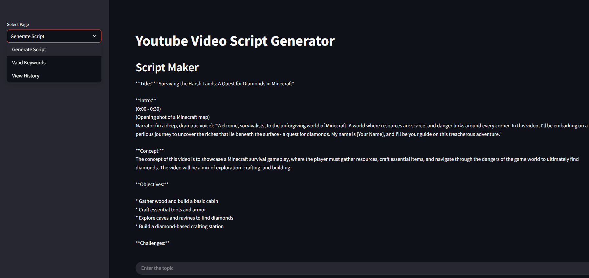

# 🎬 YouTube Script Generator (LLaMA 3 + Streamlit)

A dynamic Streamlit web app that uses **LLaMA 3.1 via Groq API** to generate structured YouTube video scripts from any topic. It supports intelligent validation, asynchronous script generation, script history management, and a live typing effect for an engaging experience.

---

## ✨ Features

- 🧠 AI-generated scripts with **Title, Intro, Concept, Objectives, Challenges, Storyline, Final Result, Outro**
- 🔍 Keyword validation to ensure video-relevant content
- 🧵 Asynchronous script generation for smooth performance
- 💾 History saving and deletion
- 📜 Live typing effect for generated scripts
- 📑 Valid keywords viewer built-in

---

## ⚙️ Tech Stack

| Technology          | Purpose                                                |
|---------------------|--------------------------------------------------------|
| Python              | Core programming language                              |
| Streamlit           | Frontend Web App framework                             |
| Groq API (LLaMA 3)  | AI model for chatbot/script responses                  |
| dotenv              | Securely manage API keys                               |
| concurrent.futures  | Handle async script generation                         |
| Pillow (optional)   | Image handling (if extended with images)               |
| json & os           | For data storage and environment handling              |

---

## 🚀 Getting Started

### 1. Clone the Repository

```bash
git clone https://github.com/your-username/youtube-script-generator.git
cd youtube-script-generator
```
### 2. Install Dependencies
It's recommended to use a virtual environment:

```bash
python -m venv venv
venv\\Scripts\\activate # For MAC: source venv/bin/activate
```
- Install the required packages:

```bash
pip install -r requirements.txt
```
### 3. Set Up .env
Create a .env file in the root directory and add your Groq API key:
```bash
GROQ_API_KEY=your_api_key_here
```

### 4. Run the App
```bash
streamlit run app.py
```
---
## 🖥️ App Pages
- Generate Script – Main interface to input your video topic and get a structured script.

- Valid Keywords – View the list of accepted video-related keywords.

- View History – See previously generated scripts and delete them if needed.
---
## 📸 UI Preview
Add a screenshot to assets/screenshot.png and uncomment this in your README if desired:


---
## 🧠 Prompt Format
The AI is instructed to generate responses using a structured format:

- Title

- Intro

- Concept

- Objectives

- Challenges

- Storyline

- Final Result

- Outro
---

## 🧑‍💻 Author
Built by Pramit Acharjya
For content creators, scriptwriters, and AI enthusiasts.
---
## 🪪 License
MIT License — free to use, modify, and distribute.
